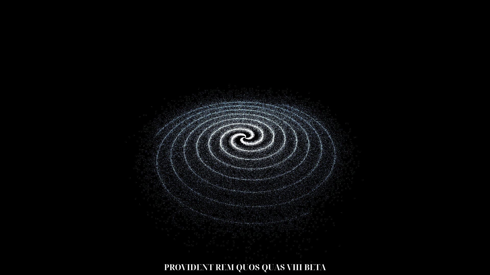

# Yoan's Galaxy Generator

<a href='http://yoans-galaxy-generator.vercel.app/'>
  
</a>

## What's this project

An experiment made to learn ThreeJS !
This experiment uses particles to generate galaxies, tweak the different params or press the button to generate a random galaxy !
Each time you press the button your galaxy gets a random super cool name (with a cool little animation too ;)) !
[➡️ Click here to see the live experiment ⬅️](http://yoans-galaxy-generator.vercel.app/)

## Setup

Download [Node.js](https://nodejs.org/en/download/).
Run the followed commands:

```bash
# Install dependencies (only the first time)
npm install

# Run the local server at localhost:8080
npm run dev

# Build for production in the dist/ directory
npm run build
```

## Thanks

This experiment was made possible by [Three.js journey by Bruno Simon](https://threejs-journey.com) 🎉 <br />
I'm still learning Three.js and I hope I can make beautiful websites soon !

If you're interested at what I do you can follow me on Twitter [https://twitter.com/yoansj](https://twitter.com/yoansj) <br />

I'm currently looking for a part-time job 💼 <br />
Want to work with me ? Email me at 📧 yoansjpro@gmail.com 📧

Thanks for reading this far ! <br />
You earned the right to see my previous experiment ➡️ [https://haunted-house-gilt.vercel.app/](https://haunted-house-gilt.vercel.app/)
